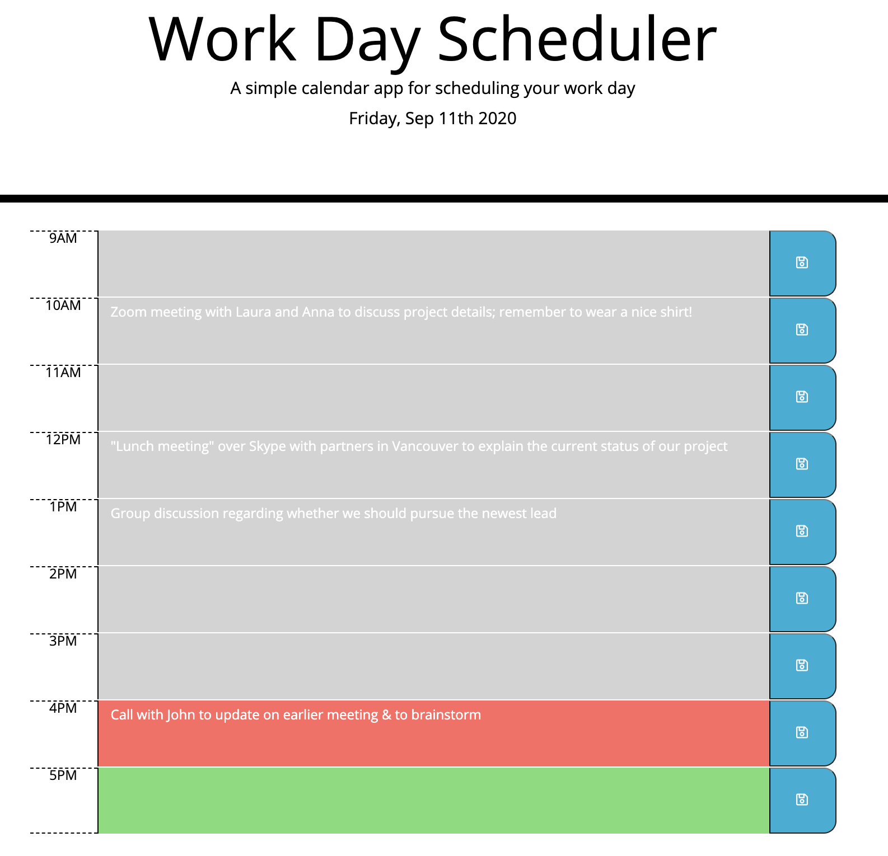

See the deployed site: https://rachelkline.github.io/WorkDayScheduler/

In this project, we were tasked with creating a functional work day scheduler (between the hours of 9AM and 5PM) that would change colors depending on the time of day. We were given some starter HTML and CSS styling and had to build the application around that given information. To do this, I created a script page that would utilize moment.js to provide real-time information.

We also had to create text blocks within the calendar that would be functional to write messages. These messages were to be saved to localStorage after a button click and when the page is refreshed, the text would still be there.

Overall, this project was a bit challenging but really fun to execute! I am really happy with my finished product and I think I learned a lot from this exercise. 